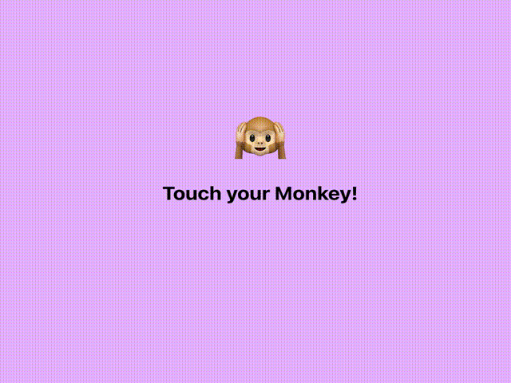

# 구현결과

# About

이번 다크모드 UI는 `styled-components`를 활용하여 구현했습니다.

기존 CSS 파일 안에 다른 컴포넌트들의 모든 CSS를 관리하는 것과 달리 컴포넌트 별로 한눈에 JSX와 CSS를 편리하게 관리할 수 있다는 점이 상당히 편하고 세련됐다라는 느낌을 받았습니다.

기존 토글 스위치를 활용하여 다크모드를 제작해보려고 했으나, 갑자기 이모티콘 구경을 하다가 작은 아이디어가 떠올라서 원숭이를 건드리면 눈을 가렸을 때 앞이 깜깜해지는 느낌을 적용해보려고 했습니다.
